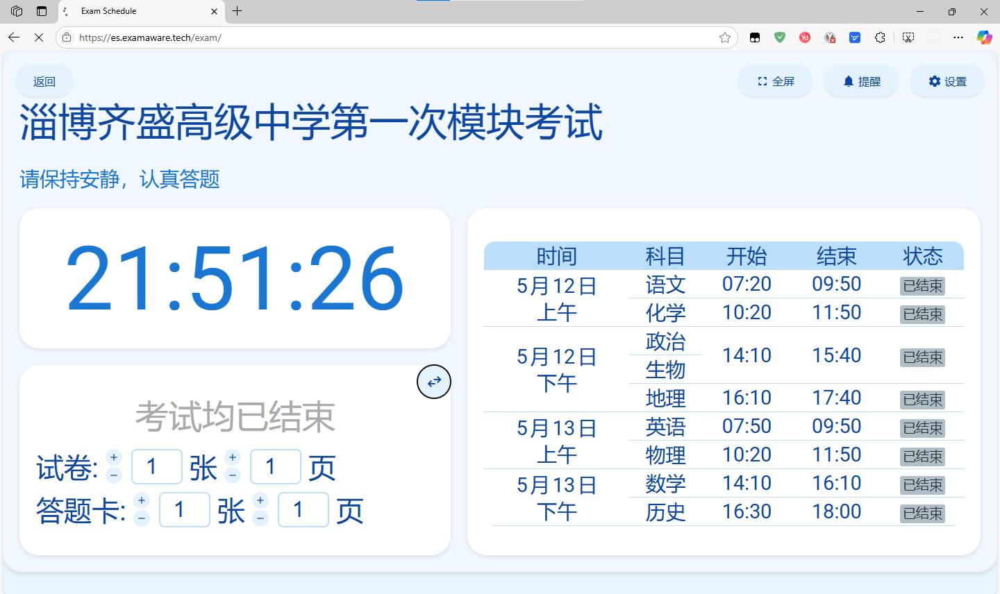
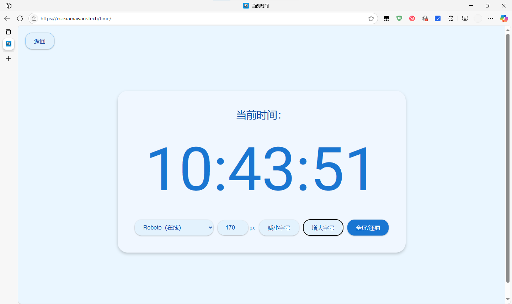

# ExamSchedule

**不只是考试看板。**

## 功能

- 考试看板
  - 实时显示当前时间、当前考试科目、考试起止时间、剩余时间及考试状态。
  - 支持全屏显示。
  - 支持设置时间偏移和考场信息，并保存到浏览器Cookie中。
  - 支持临时编辑消息，并保存到浏览器Cookie中（3天后到期）。
- 时间广播
  - 支持自定义广播配置。
  - 支持打开本地json配置

### 考试看板设置说明

点击设置按钮可以打开设置窗口，进行以下配置：

- **时间偏移**：用于调整显示的时间，单位为秒。
- **考场信息**：用于显示当前考场的名称。
- **页面缩放倍数**：用于调整页面显示的缩放倍数。
- **亮/暗色模式**：用于切换页面的亮/暗色模式背景。

配置完成后点击保存按钮，设置将会保存到浏览器的Cookie中，并立即生效。

## 软件截图

### 主界面

#### 考试展板界面

#### 电子钟表界面

## 如何部署？

 您可以点击查看 [部署教程](https://docs.examaware.tech/app/web/web-deploy.html)了解详细的部署教程。

## 开发说明

- 正在 [`main`](https://github.com/ExamAware/ExamSchedule/commits/master) 分支上提供稳定版本。
- 正在 [`dev`](https://github.com/ExamAware/ExamSchedule/commits/dev) 分支上进行开发。

## 贡献

欢迎提交[Issue](https://github.com/ExamAware/ExamSchedule/issues)和[Pull Request](https://github.com/ExamAware/ExamSchedule/pulls)来贡献代码。
